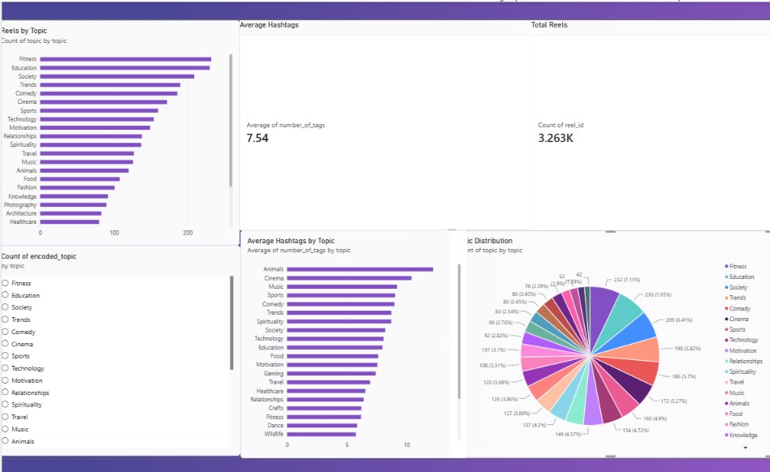

# Instagram Reels Analytics Dashboard

## Project Overview

This project analyzes Instagram Reels data using SQL, MySQL, and Power BI.

The objective of this project is to identify popular reel topics, analyze hashtag usage patterns, and generate insights through SQL analysis and interactive Power BI visualizations.

---

## Tools Used

- MySQL
- MySQL Workbench
- SQL
- Power BI
- GitHub

---

## Dataset

The dataset used in this project contains Instagram Reels information including hashtags, topics, and hashtag counts.

Dataset Source:

https://www.kaggle.com/datasets/lokeshbhaskar/instagram-reels-dataset-cleaned

---

## Database Structure

This project uses the following tables:

### users
Stores user information.

### categories
Stores content categories.

### content
Stores saved content information.

### content_categories
Maps content to categories using confidence scores.

### reels
Stores Instagram Reels data imported from CSV.

---

## SQL Concepts Used

- SELECT
- WHERE
- ORDER BY
- GROUP BY
- HAVING
- Aggregate Functions
- JOINs
- Views
- Subqueries
- CTEs (Common Table Expressions)
- Window Functions
- RANK()
- DENSE_RANK()
- Date Functions
- Stored Procedures
- Data Import using LOAD DATA INFILE

---

## Business Questions Answered

1. How many reels are available in the dataset?
2. Which topics have the highest number of reels?
3. What is the average number of hashtags used per topic?
4. What are the Top 5 most popular reel topics?
5. Which topics have fewer than 100 reels?
6. Which reels contain fitness-related hashtags?
7. Which reels use more hashtags than the overall average?
8. What percentage of total reels belongs to each topic?
9. Which topics rank highest based on reel count?
10. Which topics perform above the average reel count?
11. Which topics use the highest average number of hashtags?

---

## Power BI Dashboard

The Power BI dashboard provides interactive visualizations for Instagram Reels analysis.

### Dashboard Features

- Total Reels KPI
- Average Hashtags KPI
- Reels by Topic
- Topic Distribution
- Average Hashtags by Topic
- Interactive Topic Filter (Slicer)

### Dashboard Preview



---

## Key Insights

- Total Reels Analyzed: 3,263
- Average Hashtags per Reel: 7.54
- Fitness and Education are among the most common reel topics.
- Different topics show different hashtag usage patterns.
- Some topics contribute significantly more reels than others.

---

## Project Structure

```text
Instagram-Reels-Analytics/
│
├── README.md
├── smart_content_organizer.sql
├── Instagram_Reels_Analytics.pbix
└── dashboard.jpg
```

---

## What I Learned

Through this project, I improved my understanding of:

- SQL Querying
- Database Design
- Data Import and Cleaning
- JOIN Operations
- Views
- Subqueries
- CTEs
- Window Functions
- Ranking Functions
- Stored Procedures
- Power BI Dashboard Development
- Data Visualization
- GitHub Project Documentation

---

## Future Improvements

- Add more advanced SQL analysis.
- Create additional Power BI KPIs.
- Analyze hashtag trends in greater detail.
- Build predictive analytics models for content performance.

---

## Author

**Sherin Ebadhi H**

Data Analytics Enthusiast | SQL | MySQL | Power BI | Python

GitHub:
https://github.com/sherin0011
